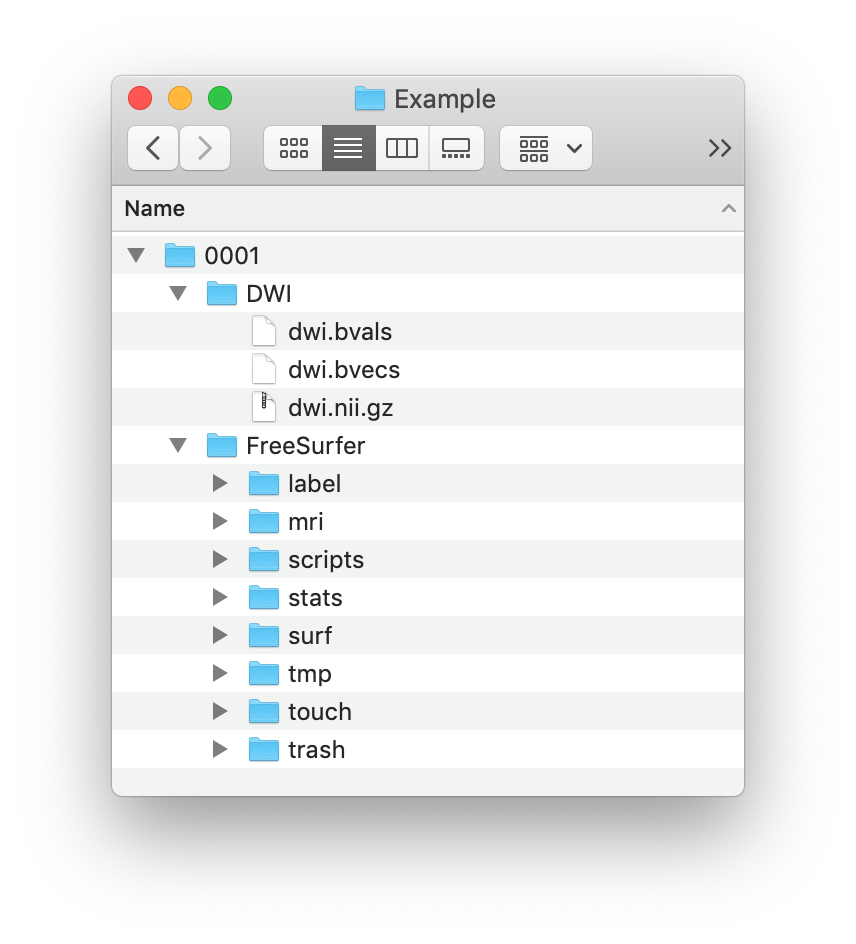

.. role:: button
   :class: btn btn-outline-primary

Examples
=================
 
Structural processing example
--------------------------------------

Data
^^^^^^
The following example uses the FreeSurfer (``freesurfer``) and DWI data (``dtiinit``) of subject ``0001`` from `the Open Diffusion Data Derivatives (O3D) repository <https://brainlife.io/pub/5a0f0fad2c214c9ba8624376>`_, that can be downloaded after a quick sign-up. After unpacking and putting the FreeSurfer data in a folder ``FreeSurfer`` and the DWI data in a folder ``DWI``, we have the following files:

Reconstruction using a configuration file
^^^^^^^^^^^^^^^^^^^^^^^^^^^^^^^^^^^^^^^^^^^^^^^^^^^^^^^^
This example processes Subject 0001 using the ``preprocess_eddy.sh`` preprocessing script. This preprocessing script performs a.o. eddy current correction using eddy from FSL. Eddy needs as input the phase encoding direction of the scans which we provide using the variable :term:`revPhaseEncDim`. The dataset informs us that this direction is Anterior -> Posterior and the DWI file is in RAS orientation, so the phase encoding dimension is the 2nd dimension (``"revPhaseEncDim": 2``).

The following configuration file provides the minimum parameters that need to be specified. Copy the text and save it in a file (e.g. ``/Volumes/Example/CATO.conf``).

    .. code-block:: JSON

        {
            "general":{
               "fslRootDir":"UPDATE_THIS",
               "freesurferRootDir":"UPDATE_THIS",
               "freesurferDir":"FreeSurfer",
               "templates": ["aparc", "lausanne120", "lausanne250"]
            },
            "structural_preprocessing":{
               "rawBvalsFile":"DWI/dwi.bvals", 
               "rawBvecsFile":"DWI/dwi.bvecs", 
               "dwiFile":"DWI/dwi.nii.gz", 
               "preprocessingScript":"TOOLBOXDIR/structural_preprocessing/preprocess_eddy.sh",
               "revPhaseEncDim": 2
            }
         }

.. .. list-table:: Configuration parameters
..  :header-rows: 1

..  *   - Parameter
..      - Comments
..  *   - fslRootDir
..      - Update this parameter to your FSL installation directory.
..  *   - freesurferRootDir
..      - Update this parameter to your FreeSurfer installation directory.
..  *   - freesurferRootDir
..      - Update this parameter to the FreeSurfer installation directory.       
..  *   - templates
..      - In this example the Desikan Killiany parcellation and subparcellations are selected.
..  *   - rawBvalsFile
..      - Location of the bvals-file.
..  *   - rawBvecsFile
..      - Location of the bvecs-file.
..  *   - dwiFile
..      - Location of the DWI file
..  *   - preprocessingScript
..      - The example script for preprocessing using eddy form FSL is selected.
..  *   - revPhaseEncDim                
..      - The phase encoding direction. In this example the second direction (A --> P).                                 

Now you can run the structural pipeline with this configuration file:

.. content-tabs::

    .. tab-container:: tab1
        :title: Executable

        .. code-block::

            structural_pipeline -s /Volumes/Example/0001 \
                -m MCRDIR_UPDATE_THIS \
                --configurationFile=/Volumes/Example/CATO.conf

        where ``MCRDIR_UPDATE_THIS`` is the MCR installation directory (e.g. ``/Applications/MCR/v93``)

    .. tab-container:: tab2
        :title: MATLAB

        .. code-block::

            subjectDir = '/Volumes/Example/0001';
            configurationFile = '/Volumes/Example/CATO.conf';
            structural_pipeline(subjectDir, ...
                'configurationFile', configurationFile);

CATO with command-line parameters
^^^^^^^^^^^^^^^^^^^^^^^^^^^^^^^^^^

Instead, or in addition to a configuration file, all parameters can also be specified on the command line:

.. content-tabs::

    .. tab-container:: tab1
        :title: Executable

        .. code-block::

            structural_pipeline -s /Volumes/Example/0001 \
                -m MCRDIR_UPDATE_THIS \
                --general.fslRootDir='UPDATE_THIS' \
                --general.freesurferRootDir='UPDATE_THIS' \
                --general.templates='["aparc","lausanne120","lausanne250"]' \
                --structural_preprocessing.rawBvalsFile='DWI/dwi.bvals' \
                --structural_preprocessing.rawBvecsFile='DWI/dwi.bvecs' \
                --structural_preprocessing.dwiFile='DWI/dwi.nii.gz' \
                --general.freesurferDir='FreeSurfer' \
                --structural_preprocessing.preprocessingScript='TOOLBOXDIR/structural_preprocessing/preprocess_eddy.sh' \
                --structural_preprocessing.revPhaseEncDim='2' 

    .. tab-container:: tab2
        :title: MATLAB

        .. code-block::

            subjectDir = '/Volumes/Example/0001';
            structural_pipeline(subjectDir, ...
                'general.fslRootDir', 'UPDATE_THIS', ...
                'general.freesurferRootDir', 'UPDATE_THIS', ...
                'general.templates', {'aparc', 'lausanne120', 'lausanne250'}, ...
                'structural_preprocessing.rawBvalsFile', 'DWI/dwi.bvals', ...
                'structural_preprocessing.rawBvecsFile', 'DWI/dwi.bvecs', ...
                'structural_preprocessing.dwiFile', 'DWI/dwi.nii.gz', ...
                'general.freesurferDir', 'FreeSurfer', ...
                'structural_preprocessing.preprocessingScript', 'TOOLBOXDIR/structural_preprocessing/preprocess_eddy.sh', ...
                'structural_preprocessing.revPhaseEncDim', 2);

Functional processing example
--------------------------------------
This example processes EXAMPLESUBJECT using the ``preprocess_default.sh`` preprocessing script. This preprocessing script performs a.o. slice time correction, motion correction, and mapping of the T1 parcellation to the rs-fMRI image (see :ref:`functional_preprocessing`). The following configuration file provides the minimum parameters to run the functional pipeline (including applying a bandpass filter and scrubbing). Copy the text and save it in a file (e.g. ``/Volumes/Example/CATO_functional.conf``).

    .. code-block:: JSON

        {
            "general":{
                "fslRootDir":"UPDATE_THIS",
                "freesurferRootDir": "UPDATE_THIS",         
                "freesurferDir": "T1/SUBJECT_FS",
                "templates": ["aparc", "lausanne120", "lausanne250"]
            },
            "functional_preprocessing":{
                "fmriFile": "fMRI/SUBJECT_fmri.nii.gz",
                "preprocessingScript": "TOOLBOXDIR/functional_preprocessing/preprocess_default.sh",
                "sliceTimingCorrection": true,
                "sliceTimerOptions": ""                
            },
            "reconstruction_functional_network":{
                "methodDescription": "scrubbed_0.01-0.1",
                "regression":{
                    "regressionMask": [2, 41, 24],
                    "globalMeanRegression": false
                },
                "bandpass_filter":{
                    "filter": true,
                    "frequencies": [0.01, 0.1]
                },
                "scrubbing":{
                    "scrubbing": true,
                    "maxFD": 0.25, 
                    "maxDVARS": 1.5, 
                    "minViolations": 2,
                    "backwardNeighbors": 1,
                    "forwardNeighbors": 0
                }
            }
        }

To run the functional pipeline with this configuration file:

.. content-tabs::

    .. tab-container:: tab1
        :title: Executable

        .. code-block::

            functional_pipeline -s /Volumes/Example/0001 \
                -m MCRDIR_UPDATE_THIS \
                --configurationFile=/Volumes/Example/CATO_functional.conf

        where ``MCRDIR_UPDATE_THIS`` is the MCR installation directory (e.g. ``/Applications/MCR/v93``)

    .. tab-container:: tab2
        :title: MATLAB

        .. code-block::

            subjectDir = '/Volumes/Example/0001';
            configurationFile = '/Volumes/Example/CATO_functional.conf';
            functional_pipeline(subjectDir, ...
                'configurationFile', configurationFile);

