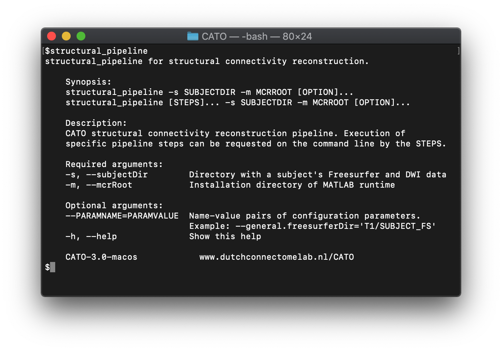
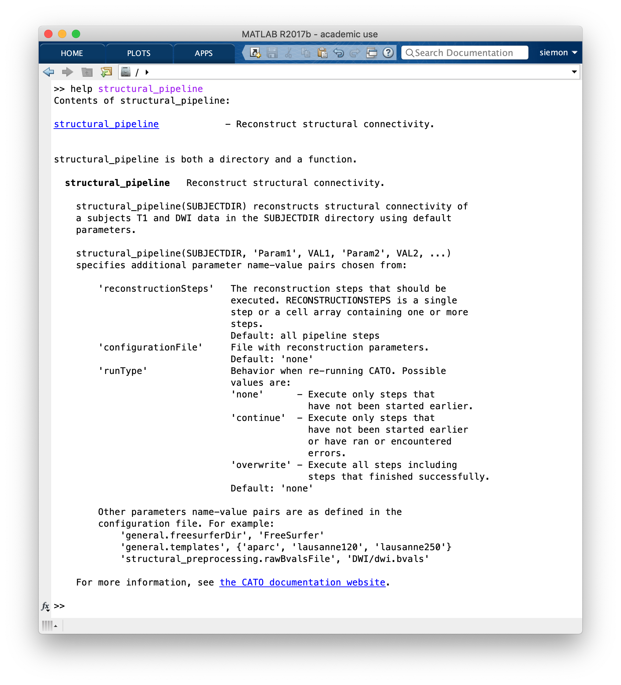

.. role:: button
   :class: btn btn-outline-primary

Installation 
=================

Download
--------------------
 
Compiled binaries of the latest toolbox version:

.. raw:: html
	:file: ../_static/emailform.html

and all source code is available on `the GitHub repository <https://github.com/dutchconnectomelab/CATO/>`_. CATO is also available as Docker image on `Docker Hub <https://hub.docker.com/r/dutchconnectomelab/CATO>`_.

Example configuration files can be downloaded (or use the :ref:`online Configuration Assistant <configuration assistant>`):
 
 	- :download:`Example functional configuration file <../_static/configuration_files/configuration_functional_example.json>`
 	- :download:`Example structural configuration file <../_static/configuration_files/configuration_structural_example.json>`

Additional software often used with CATO are described in the :ref:`Installation additional software` section.

.. toggle-header::
    :header: **Release notes**

    Older versions of CATO (executibles and source-code) can be downloaded from `the CATO repository on Github <https://github.com/dutchconnectomelab/CATO/releases>`_ and older versions of this documentation website (corresponding to older CATO versions) can be downloaded from `the CATO docs repository on Github <https://github.com/dutchconnectomelab/CATO-docs/releases>`_ .

    - Version 3.1.2 (28 May 2021)
    	- Fixes minor issue that let MATLAB utilize all available computational threads, but which is undesirable when running multiple instances of CATO in parallel. This minor patch introduces the parameter :term:`maxNumberCompThreads` (default = 1) that lets the user set the maximum number of used computational threads.

    - Version 3.1.1 (22 March 2021)
    	- Fixes minor issue that caused in some configurations a "non-existent field" error. This is a minor patch does not affect any MRI processing. This error can also be fixed by adding a variable that specifies the lutFile in the collect_region_properties step in the configuration file:  ::

    		"collect_region_properties":{
			"lutFile": "TEMPLATESDIR/TEMPLATE/TEMPLATE.annot.ctab"
    		}

    - Version 3.1 (16 March 2021)
    	- Memory usage is reduced in the diffusion reconstruction step when correcting for gradient nonlinearities.
    	- Fixes an issue with the lausanne parcellations that nodes are incorrectly ordered and labeled. This issue affected only version 3.0 and the lausanne120, lausanne250 and lausanne500 parcellations (the Desikan-Killiany, aparc, parcellation is not affected).
    	- Fiber tracker seeds are now better distributed and compatible with high-quality DWI data.
    	- The CSD and DTI diffusion reconstruction methods are further improved to give better diffusion profile reconstructions.

Installation executable
------------------------------------------------------------
1. Download the latest toolbox version and unzip the archive to your preferred location (e.g. ``/Users/DCL/``).

2. The next steps add the CATO directory to your ``PATH`` variable such that the system can execute CATO.

	a. Create the startup file ``.bash_profile`` in your home directory (for example ``/Users/USERNAME/.bash_profile`` on macOS) and open the file in a text editor.

	b. Add the CATO directory (e.g. ``/Users/DCL/CATO-3.0-macos``) to the ``PATH`` variable by adding the following line to the end of the ``.bash_profile``:: 

		export PATH="/Users/DCL/CATO-3.0-macos:$PATH"

	c. Save and close the file. Open a new terminal window, to bring the changes into effect.

3. The toolbox is now installed!

You can now run the structural and functional pipelines from the terminal::

	structural_pipeline

The command line output gives a brief description of arguments accepted by the structural pipeline:

Similarly, you can  also execute the functional pipeline by running::

	functional_pipeline

Before you can use CATO to reconstruct connectomes, ensure that **all required software (FreeSurfer, MCR and FSL) is installed.** See the section :ref:`Installation additional software` for more information.

Installation MATLAB Toolbox
------------------------------------------------------------

CATO requires MATLAB version R2017b (other versions might work, but R2017b has been extensively tested), the "Signal Processing Toolbox" and "Statistics and the Machine Learning Toolbox".

1. Download all code as `zip file <https://github.com/dutchconnectomelab/CATO/archive/master.zip>`_ or from the `GitHub repository <https://github.com/dutchconnectomelab/CATO/>`_.

3. MATLAB needs to know the location of the CATO toolbox. Locate the directory with the toolbox and add this directory to your MATLAB path using the `addpath <https://www.mathworks.com/help/matlab/ref/addpath.html>`_ command or using the `"Set Path" option in MATLABs graphical user interface <https://nl.mathworks.com/help/matlab/matlab_env/add-remove-or-reorder-directorys-on-the-search-path.html>`_: ::

	addpath(genpath('/Users/DCL/CATO-3.0-beta-MATLAB/src'))

4. The toolbox is now installed!

Before you can use CATO to reconstruct connectomes, you need to **ensure all required software (FreeSurfer and FSL) is installed**. See the section :ref:`Installation additional software` for more information.

You can verify the installation by looking at the help-description of the structural pipeline in MATLAB::

	help structural_pipeline

The result  is a description of the :ref:`structural_pipeline <structural_pipeline>`:

Installation additional software
------------------------------------------------------------

MATLAB Compiler Runtime
^^^^^^^^^^^^^^^^^^^^^^^^^^^^^^^^^^^^
To run the compiled executable, the MATLAB Compiler Runtime (MCR) version 9.3 is required. You can freely download and install MCR by following the instructions on their official website:

	http://mathworks.com/products/compiler/mcr

It is **important** to get the correct MCR version (9.3, corresponding to MATLAB R2017b).

FSL - FMRIB Software Library
^^^^^^^^^^^^^^^^^^^^^^^^^^^^^^^^^^^^
The second required software is FMRIB Software Library (FSL). You can install FSL using the following instructions:

	http://fsl.fmrib.ox.ac.uk/fsl/fslwiki/FslInstallation

Make sure to install the latest version of FSL (>5.0.10), since this will be **required** for some preprocessing options. If you are installing FSL on Linux, perform a plain install without using the package manager and keep all content together in a single parent directory (for instance, /usr/local/fsl/5.0.10).

FreeSurfer
^^^^^^^^^^^^^^^^^^^^^^^^^^^^^^^^^^^^
The third required software package is FreeSurfer. Downloads and instructions are available on their official website:

	http://www.freesurfer.net/fswiki/DownloadAndInstall

The pipeline is tested with FreeSurfer version 7.2.0.